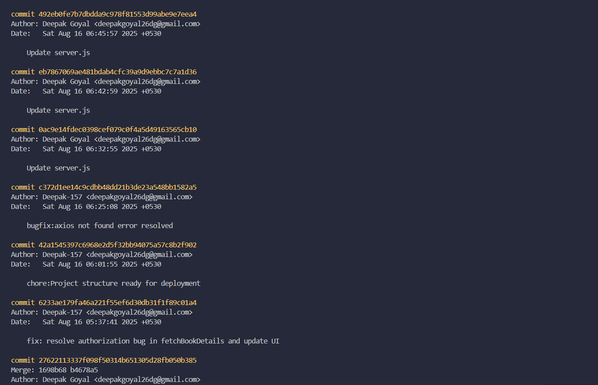

# Development History / Commit Tracking

This document provides a detailed record of the development progress for the **Book Inventory Management System** project. It includes a visual screenshot of the full git commit history as well as a table highlighting key commits.

---

## Git Log Screenshot

Below is the chronological commit history showing the development workflow, feature additions, and bug fixes:

---

## Key Commits

These commits represent important milestones, features, and bug fixes during development:

| Commit Hash | Author     | Time Ago       | Description                                                         |
| ----------- | ---------- | -------------- | ------------------------------------------------------------------- |
| 6d5f4c7     | Deepak-157 | 6 minutes ago  | chore: Readme.md added                                              |
| fbd6319     | Deepak-157 | 33 minutes ago | bugfix: setup successful for localhost                              |
| 6233ae1     | Deepak-157 | 4 hours ago    | fix: resolve authorization bug in fetchBookDetails and update UI    |
| 4742a35     | Deepak-157 | 9 hours ago    | feat(books): implement CRUD operations for book management          |
| 4a7f065     | Deepak-157 | 10 hours ago   | feat(auth): add JWT-based user authentication with password hashing |
| b1f449e     | Deepak-157 | 12 hours ago   | chore: project initialization                                       |

---

### Notes

- The screenshot shows the full commit history to demonstrate **hourly commits** and development progress.
- Key commits table emphasizes **critical features and bug fixes** for quick review.
- This structure satisfies the submission requirements for company assignments, combining both visual proof and textual context.
