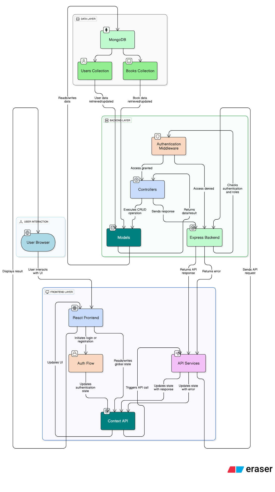

# Book Inventory System Architecture Documentation

## Database Schema

### Collections

### Users Collection

| Field     | Type     | Description                                            |
| --------- | -------- | ------------------------------------------------------ |
| \_id      | ObjectId | Unique identifier for the user                         |
| username  | String   | Required, Unique                                       |
| name      | String   | Required                                               |
| password  | String   | Required, Hashed                                       |
| role      | String   | Enum: ['ADMIN', 'EDITOR', 'VIEWER'], Default: 'VIEWER' |
| createdAt | Date     | Default: Current date                                  |

### Books Collection

| Field                 | Type     | Description                                                                                                                    |
| --------------------- | -------- | ------------------------------------------------------------------------------------------------------------------------------ |
| \_id                  | ObjectId | Unique identifier for the book                                                                                                 |
| title                 | String   | Required                                                                                                                       |
| author                | String   | Required                                                                                                                       |
| isbn                  | String   | Required, Unique                                                                                                               |
| category              | String   | Required, Enum: ['Fiction', 'Non-Fiction', 'Biography', 'Science', 'History', 'Programming', 'Self-Help', 'Business', 'Other'] |
| publicationDate       | Date     | Required                                                                                                                       |
| status                | String   | Required, Enum: ['Available', 'Borrowed', 'Lost', 'Damaged'], Default: 'Available'                                             |
| bookType              | String   | Required, Enum: ['New', 'Old']                                                                                                 |
| condition             | String   | Required, Enum: ['Excellent', 'Good', 'Fair', 'Poor']                                                                          |
| isFeatured            | Boolean  | Default: false                                                                                                                 |
| purchasePrice         | Number   | Required, Min: 0                                                                                                               |
| marketValue           | Number   | Required, Min: 0                                                                                                               |
| description           | String   | Optional                                                                                                                       |
| valueChangePercentage | Number   | Virtual (calculated)                                                                                                           |
| createdBy             | ObjectId | Reference to User, Required                                                                                                    |
| createdAt             | Date     | Default: Current date                                                                                                          |
| updatedAt             | Date     | Default: Current date                                                                                                          |

## Module/Class Breakdown

### Backend Components

#### Models

1. **User Model**

   - Defines the schema for user data
   - Implements password hashing with bcrypt
   - Provides method to verify passwords

2. **Book Model**
   - Defines the schema for book data
   - Implements virtual property for value change percentage
   - Manages timestamps for creation and updates

#### Controllers

1. **Authentication Controller**

   - `register`: Creates new user accounts
   - `login`: Authenticates users and issues JWT
   - `getMe`: Retrieves current user information

2. **Book Controller**

   - `getBooks`: Retrieves books with filtering, pagination, sorting
   - `getBookById`: Retrieves a specific book
   - `createBook`: Creates a new book
   - `updateBook`: Updates an existing book
   - `deleteBook`: Removes a book
   - `getBookStats`: Provides statistics for the dashboard

3. **User Controller**
   - `getUsers`: Retrieves all users (admin only)
   - `getUserById`: Retrieves a specific user (admin only)
   - `updateUser`: Updates user information, including role (admin only)

#### Middleware

1. **Authentication Middleware**
   - `protect`: Verifies JWT and attaches user to request
   - `authorize`: Verifies user has required role

#### Routes

1. **Authentication Routes**

   - Defines endpoints for user registration and authentication

2. **Book Routes**

   - Defines endpoints for book CRUD operations
   - Implements route protection and authorization

3. **User Routes**
   - Defines endpoints for user management
   - Restricts access to admin role

### Frontend Components

#### Context

1. **Auth Context**

   - Manages user authentication state
   - Provides login/logout functions
   - Handles role-based permissions

2. **Book Context**
   - Manages book data state
   - Provides CRUD operations for books
   - Handles filtering, sorting, pagination

#### Services

1. **Auth Service**

   - Communicates with authentication API endpoints
   - Manages JWT token storage
   - Handles user session

2. **Book Service**
   - Communicates with book API endpoints
   - Formats data for API requests
   - Processes API responses

#### Components

1. **Layout Components**

   - `SidebarLayout`: Main application layout with navigation
   - `MainLayout`: Content wrapper with header

2. **Auth Components**

   - `LoginPage`: User login form
   - `RegisterPage`: User registration form
   - `ProtectedRoute`: Route access control based on authentication and roles

3. **Book Components**

   - `BookList`: Displays books with filtering and pagination
   - `BookDetail`: Shows detailed book information
   - `BookForm`: Form for creating and editing books
   - `Dashboard`: Displays book statistics

4. **Common Components**
   - `Modal`: Reusable modal dialog
   - `Pagination`: Page navigation component
   - `Spinner`: Loading indicator

# System Flow Diagram

## Data Flow Sequence

### Authentication Flow

1. User enters credentials in the login form
2. Frontend `authService` sends credentials to `/api/auth/login` endpoint
3. Backend `authController.login` validates credentials and generates JWT
4. JWT is returned to frontend and stored in localStorage
5. `authContext` updates authentication state
6. Protected routes become accessible based on user role

### Book Management Flow

#### Fetching Books:

1. User navigates to book list page
2. `BookListPage` component initializes
3. `useBooks` hook triggers `fetchBooks` function in `bookContext`
4. `bookService.getBooks` sends request to `/api/books` with query parameters
5. Backend `bookController.getBooks` processes filters and pagination
6. MongoDB query executes and returns book data
7. Frontend updates state with received data
8. UI renders the book list with pagination controls

#### Creating/Updating Books:

1. User submits book form
2. Form validation executes on frontend
3. If valid, `createBook` or `updateBook` function from `bookContext` is called
4. `bookService` sends request to `/api/books` or `/api/books/:id`
5. Backend `bookController` validates data and performs database operation
6. Virtual field `valueChangePercentage` is calculated
7. Response is sent back to frontend
8. UI updates to show success message and navigates to book detail or list

## Security Architecture

1. **Authentication**: JWT-based authentication with expiration
2. **Password Security**: Bcrypt hashing with salt rounds
3. **Authorization**: Role-based access control at both API and UI levels
4. **Input Validation**: Form validation on frontend, express-validator on backend
5. **Protected Routes**: React components and Express middleware for route protection
6. **Cross-Origin Security**: CORS configuration on backend
7. **Session Management**: Auto-logout on role change, token expiration

## Scalability Considerations

1. **Database Indexing**: Indexes on frequently queried fields (isbn, title, author)
2. **Pagination**: Limiting result sets to prevent performance issues
3. **Modular Architecture**: Components and services are decoupled for easier scaling
4. **State Management**: Context API with optimized re-renders
5. **Caching**: API responses cached on frontend where appropriate

This architecture provides a solid foundation for the Book Inventory System, with clear separation of concerns, robust security measures, and a scalable design that can grow with additional features if needed.
